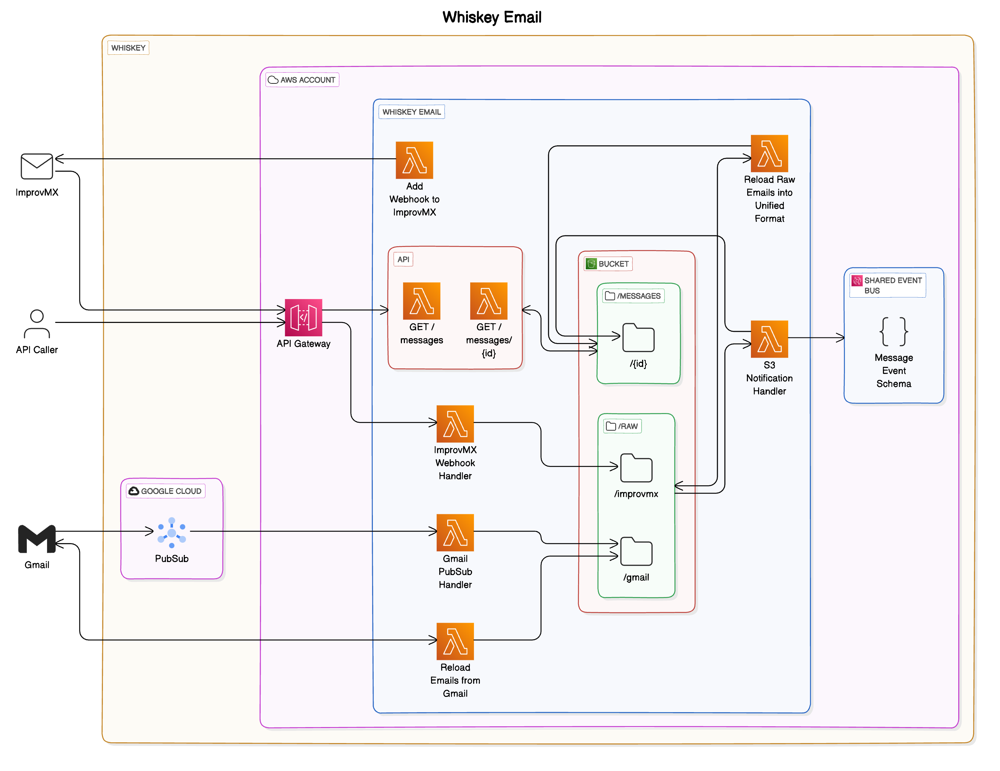

# Whiskey Email

[Whiskey](https://github.com/whiskey-platform) is an event-based personal automation system. The core entry point for events into the system is email.

This set of infrastructure enables the real-time processing and storage of emails that are sent to \*@mattwyskiel.com and mwwyskiel@gmail.com




## Core Infra

Whiskey Email contains the following:

- an S3 bucket to store emails

```
/
- raw/
  - gmail/
    - {gmail_id}.json
  - improvmx/
    - {improvmx_id}.json
- messages/
  - {id}/
      - body.html _or_ body.txt
      - attachments/
      - inlines/
      - meta.json
```

- an EventBridge Event Schema, as the Whiskey Event Bus will be hydrated with events from Whiskey Email

### Roadmap
- [x] Ingests realtime emails from Gmail, using Google PubSub integration
- [x] Ingests realtime emails from @mattwyskiel.com address, using ImprovMX webhooks
- [x] Unifies emails from both sources in common format within S3, deduplicates
- [x] Sends unified-format event to Event Bus
- [ ] Historical on-demand email ingest, from GMAIL or old email-interceptor S3 bucket
- [ ] CRUD API for messages